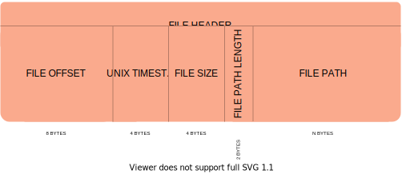

# Cup (Custom Unpacker-Packer)


## The tool

*Cup* is a simple archive tool for packing/unpacking files, it features its own archive file format without any file
compression done. It supports the following commands to be used programmatically as well as through a command-line
interface:

### Pack

Pack files/directories in a single archive file, it accepts as arguments:

* paths - Variable length argument that specifies a list of files or directories to be added to the archive.
* archive_name - Name of the archive where all files will be added.

Example:

```python
cup.pack("LICENSE", "README.md", "cup", archive_name="myarchive.cup")
```

### Unpack

Bring back archived files/directories, it has the arguments:

* renaming - Optional variable length argument specifying renaming of files.
* archive_path - Path of the archive to unpack.
* destination_path - Path where the archive will be unpacked.

Example:

```python
cup.unpack(("LICENSE", "LICENSE.OLD"), archive_path="archive.cup", destination_path="output")
```

### Info

Get information about the files contained by an archive, accepts as argument:

* archive_path - Path of the archive.

For the pack example above, it could return a list of these tuples:

```python
(0, 1069, 1606983204, 'LICENSE')
(1, 2711, 1610040784, 'README.md')
(2, 6148, 1609351145, 'dev/.DS_Store')
(3, 21, 1609338740, 'dev/dir/dir2/anotherfile.txt')
(4, 6488, 1609350881, 'dev/dir/dir2/dir2file.py')
(5, 289, 1609068210, 'dev/dir/file2.txt')
(6, 1368, 1608816734, 'dev/file.txt')
(7, 219, 1609417379, 'dev/myarchive.cup')
```

## The archive file format

The archive file format is shown below:


Explanation of its contents:

* **[File signature](https://en.wikipedia.org/wiki/File_signature)** (also called a magic number) - identifies the file
  as being a *Cup* archive.
* **File header** - holds information about the archived file
* **File content** - holds the actual content of the archived file

## The file header format

The file header format is shown below:



Its contents consist of:

* **File offset** - holds the bytes offset relative to the beginning of the archive where the contents of the file are
  found
* **UNIX timestamp of last file change** - contains the time of most recent file content modification
* **File size** - holds the bytes size of the file
* **File path length** - holds the bytes size of the file path
* **File path** - the actual file path

Example of a file header in hexadecimal notation, separated as shown above, in little endian order:

E600000000000000 5E98E45F 58050000 0C00 6465762F66696C652E747874

From this file header we can deduce the following:

* E600000000000000 - the file contents start at byte 230 in the archive
* 5E98E45F - the most recent file modification has been done at `12/24/2020 @ 1:32pm (UTC)`
* 58050000 - the file contains 1368 bytes
* 0C00 - the length of the file path in this case is of 12 bytes
* 6465762F66696C652E747874 - ASCII encoded file path, equivalent to `dev/file.txt`

PEP 257, PEP 8
